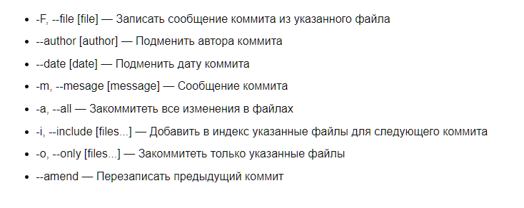
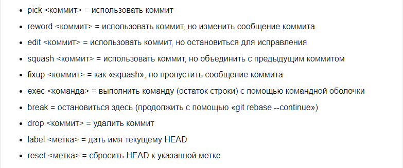

[< Вернуться к содержанию](./readme.md)

## commit

Теперь, когда ваш индекс находится в нужном состояний, пора сделать коммит ваших изменений. Запомните, что все файлы для которых вы не выполнили git add после момента редактирования — не войдут в этот коммит. На деле файлы в нём будут, но только их старая версия (если таковая имеется).

Для того что бы сделать коммит ваших изменений используйте: </br></br>

```
git commit [<опции>]
```
</br>

 </br></br>

Вы можете определить сообщение для коммита по умолчанию с помощью commit.template. Эта директива в конфигурационном файле отвечает за файл содержимое которого будет использоваться для коммита по умолчанию. Пример: git config --global commit.template ~/.gitmessage.txt.

Вы также можете изменить, удалить, объединить любой коммит.
Как вы уже могли заметить вы можете быстро перезаписать последний коммит с помощью git commit --amend.
Для изменения коммитом в вашей истории используйте </br></br>

```
git rebase -i <commit>
``` 

где commit это верхний коммит в вашей цепочке с которого вы бы хотели что либо изменить.

После выполнения git rebase -i в интерактивном меню выберите что вы хотите сделать.

 

Для изменения сообщения определённого коммита.
Необходимо изменить pick на edit над коммитом который вы хотите изменить.
Пример: вы хотите изменить сообщение коммита 750f5ae.

pick 2748cb4 first commit
edit 750f5ae second commit
pick 716eb99 third commit

После сохранения скрипта вы вернётесь в командную строку и git скажет что необходимо делать дальше:

Остановлено на 750f5ae … second commit
You can amend the commit now, with

git commit --amend

Once you are satisfied with your changes, run

git rebase --continue

Как указанно выше необходимо выполнить git commit --amend для того что бы изменить сообщение коммита. После чего выполнить git rebase --continue. Если вы выбрали несколько коммитов для изменения названия то данные операций необходимо будет проделать над каждым коммитом.

Для удаления коммита
Необходимо удалить строку с коммитом.
Пример: вы хотите удалить коммит 750f5ae
Нужно изменить скрипт с такого:
pick 2748cb4 third commit
pick 750f5ae second commit
pick 716eb99 first commit
на такой:
pick 2748cb4 first commit
pick 716eb99 third commit

Для объединения коммитов
Необходимо изменить pick на squash над коммитами которые вы хотите объединить.
Пример: вы хотите объединить коммиты 750f5ae и 716eb99.
Необходимо изменить скрипт с такого:
pick 2748cb4 third commit
pick 750f5ae second commit
pick 716eb99 first commit
На такой
pick 2748cb4 third commit
squash 750f5ae second commit
squash 716eb99 first commit

Заметьте что в интерактивном скрипте коммиты изображены в обратном порядке нежели в git log. С помощью squash вы объедините коммит 750f5ae с 716eb99, а 750f5ae с 2748cb4. В итоге получая один коммит содержащий изменения всех трёх.


