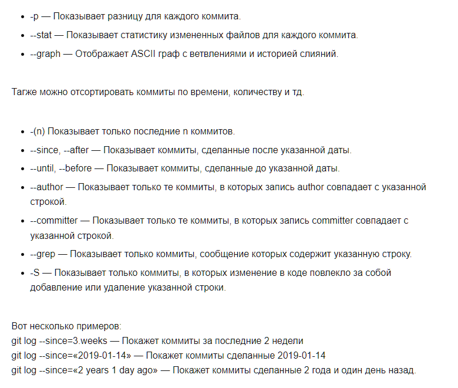

[< Вернуться к содержанию](./readme.md)

С помощью команды

```
git log [<опции>] [<диапазон-редакций>]
```
вы можете просматривать историю коммитов вашего репозитория. Есть также куча параметров для сортировки и поиска определённого коммита.

Полезные параметры команды git log:



Также вы можете настроить свои формат вывода коммитов с помощью

```
git log --format:["format"]
```
