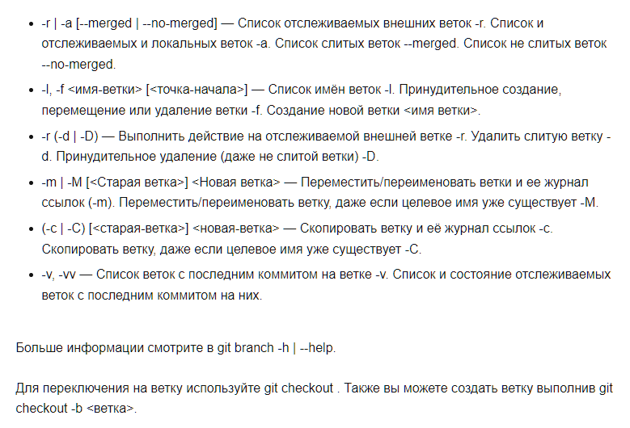

Для создания ветки используйте

```
git branch <branch_name> [<start_commit>]
```
Здесь branch_name это название для новой ветки, а start_commit это коммит на который будет указывать ветка (то есть последний коммит в ней). По умолчанию ветка будет находится на последнем коммите родительской ветки.

Опции git branch:




## [< Вернуться к содержанию](./readme.md)